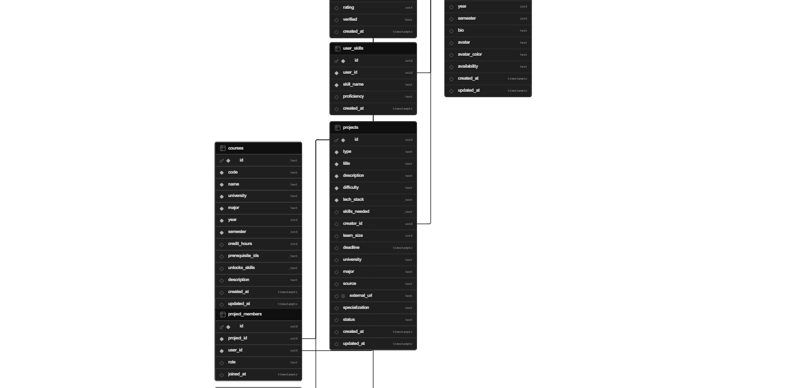

# Team-Finder

Team-Finder is a university student team-matching platform for students at the
University of Jordan (`@ju.edu.jo`) and Hashemite University (`@hu.edu.jo`).

Students create a structured profile with their major, courses, skills,
availability, learning progress, and bio. Once the profile wizard is complete,
the platform can help them discover projects, find teammates, use learning
resources, and interact with an AI assistant connected to their academic profile.

## Core Product Flow

1. A student signs up or logs in with a supported university email.
2. The student completes the profile wizard.
3. A completed profile unlocks meaningful project discovery and matching.
4. The dashboard becomes the main hub for projects, learning, and AI guidance.
5. The learning page combines university courses, developer tools, personalized
   roadmaps, progress tracking, and resource enrichment from the prefetching
   pipeline.

For the current visual user journey, see
[docs/WORKFLOW_DIAGRAM_V2.md](docs/WORKFLOW_DIAGRAM_V2.md).

## Main Features

- University-gated authentication for JU and HU students.
- Profile wizard for academic and collaboration readiness.
- Project browsing, creation, detail views, and matching-oriented discovery.
- Client-side match scoring using skill vectors, availability, rating, and
  penalties.
- Learning page with courses, dev tools, personalized paths, and progress.
- AI assistant backed by a FastAPI + LangGraph backend.
- Resource and project enrichment through the data prefetching pipeline.

## Tech Stack

| Layer | Technology |
| --- | --- |
| Frontend | Next.js 14 App Router, TypeScript, React, TailwindCSS |
| Backend | Python FastAPI, LangGraph, Anthropic Claude |
| Auth | Supabase Auth |
| Database | Supabase PostgreSQL |
| Data pipeline | TypeScript prefetcher and API wrapper |

## Project Structure

```text
Team-Finder/
|-- frontend/              # Next.js application
|   |-- src/app/           # App Router pages and API routes
|   |-- src/components/    # UI, dashboard, profile, learning components
|   |-- src/algorithm/     # Match scoring engine
|   |-- src/hooks/         # Learning, progress, roadmap hooks
|   |-- src/lib/           # Supabase clients, auth, validation, APIs
|   `-- src/data/          # Static course, skill, roadmap, tool data
|-- backend/               # FastAPI + LangGraph AI assistant
|   |-- app/               # FastAPI entrypoint and auth core
|   |-- ai_agent/          # Agent tools and system prompt
|   `-- scripts/           # Roadmap/dev-tool seed scripts
|-- supabase/migrations/   # Database migrations
|-- data/generators/       # API wrapper and prefetching pipeline
|-- docs/                  # Active documentation
`-- TESTING_GUIDE.md       # Manual testing guide
```

## Setup

### Prerequisites

- Node.js 18+
- Python 3.11+
- Supabase project
- Anthropic API key

### Environment

Copy `.env.example` to `.env` and fill in the required values:

```env
DATABASE_URL=postgresql://...
NEXT_PUBLIC_SUPABASE_URL=https://...
NEXT_PUBLIC_SUPABASE_ANON_KEY=...
SUPABASE_SERVICE_ROLE_KEY=...
SUPABASE_JWT_SECRET=...
ANTHROPIC_API_KEY=...
NEXT_PUBLIC_APP_URL=http://localhost:3002
```

The frontend also needs the public Supabase values available in
`frontend/.env.local`.

### Frontend

```bash
cd frontend
npm install
npm run dev
```

The frontend runs on `http://localhost:3002`.

### Backend

```bash
cd backend
pip install -r requirements.txt
python app/main.py
```

The backend runs on `http://localhost:8000`.

## Database ERD

The canonical ERD is provided by the project architect and stored in the docs
assets folder:



## Active Documentation

| Document | Purpose |
| --- | --- |
| [docs/README.md](docs/README.md) | Documentation hub |
| [docs/WORKFLOW_DIAGRAM_V2.md](docs/WORKFLOW_DIAGRAM_V2.md) | Current canonical workflow diagram |
| [docs/WORKFLOW_DIAGRAM.md](docs/WORKFLOW_DIAGRAM.md) | Existing workflow diagram kept for reference |
| [docs/assets/erd.png](docs/assets/erd.png) | Canonical ERD image |
| [TESTING_GUIDE.md](TESTING_GUIDE.md) | Manual testing guide |

## Security Notes

- University affiliation must come from verified auth metadata, not request
  bodies.
- Authenticated writes should use server-side user verification.
- The AI assistant write surface is intentionally limited to user-owned learning,
  course, and skill/profile-adjacent operations exposed by its tools.

## License

See [LICENSE](LICENSE).
