# Team-Finder System Architecture & Workflow Diagram

> Visual representation of the complete system pipeline and function interactions

---

## System Architecture Overview

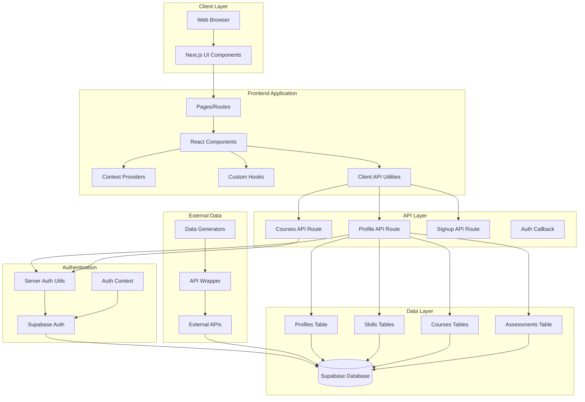

---

## User Authentication Flow

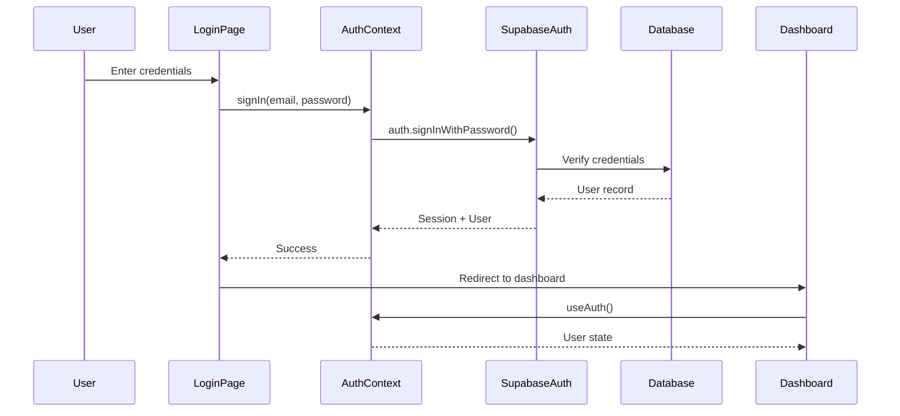

---

## User Registration Flow

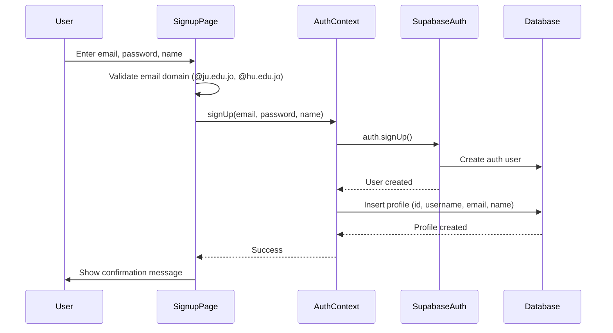

---

## Profile Creation/Update Flow

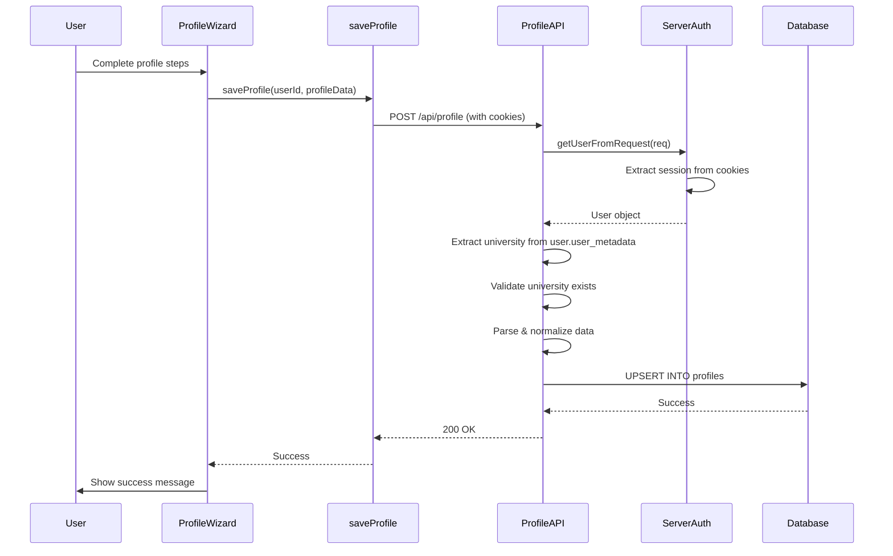

---

## Skill Selection & Matching Flow

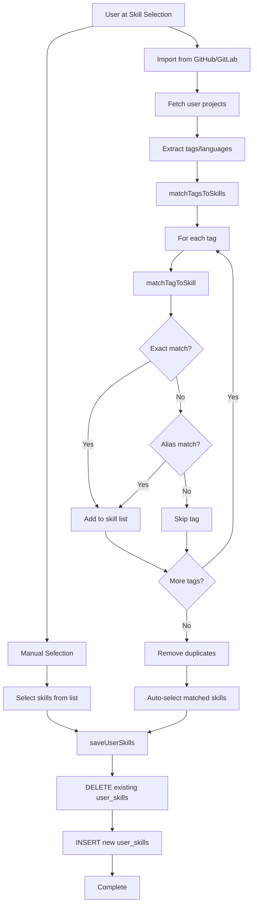

---

## Skill Assessment Flow

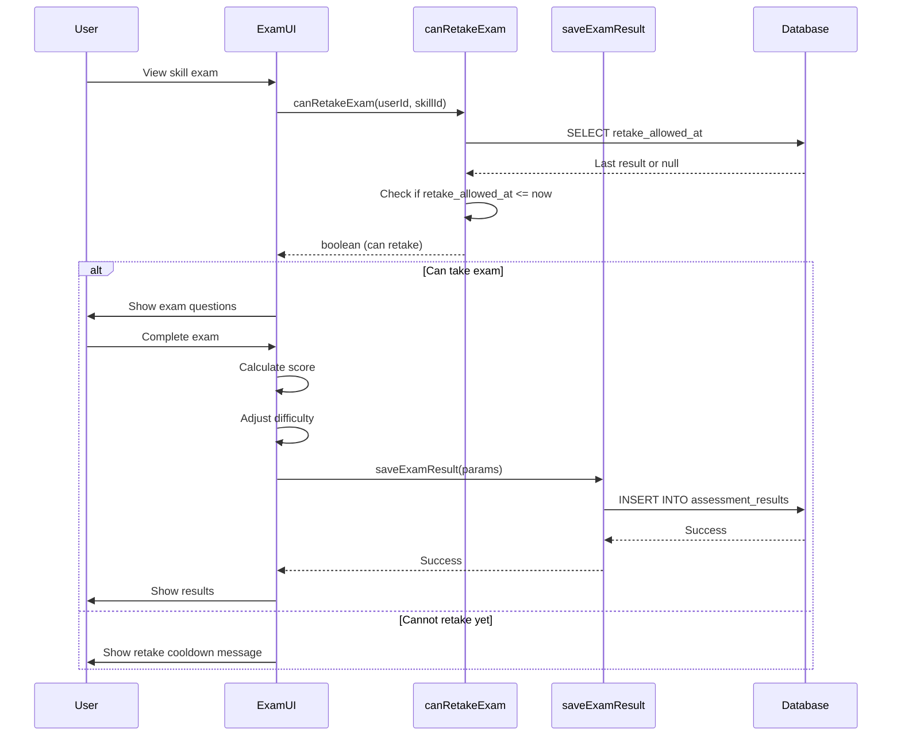

---

## Course Selection Flow

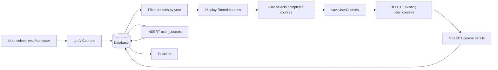

---

## Data Prefetcher Pipeline

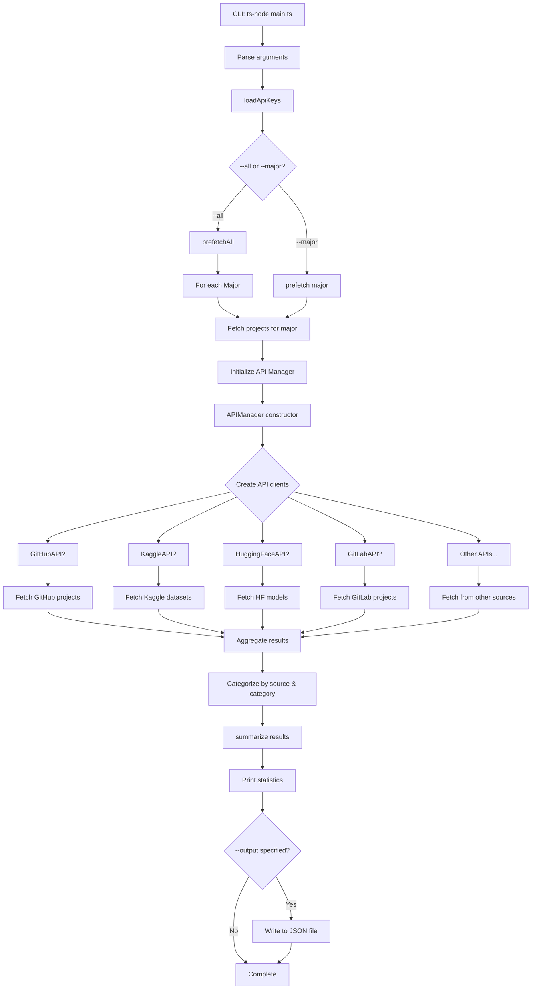

---

## API Manager Initialization

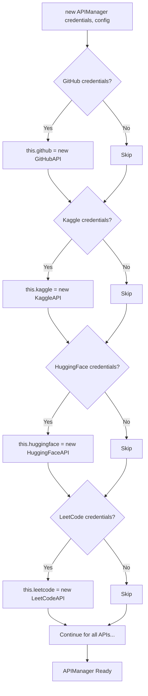

---

## Database Migration Flow

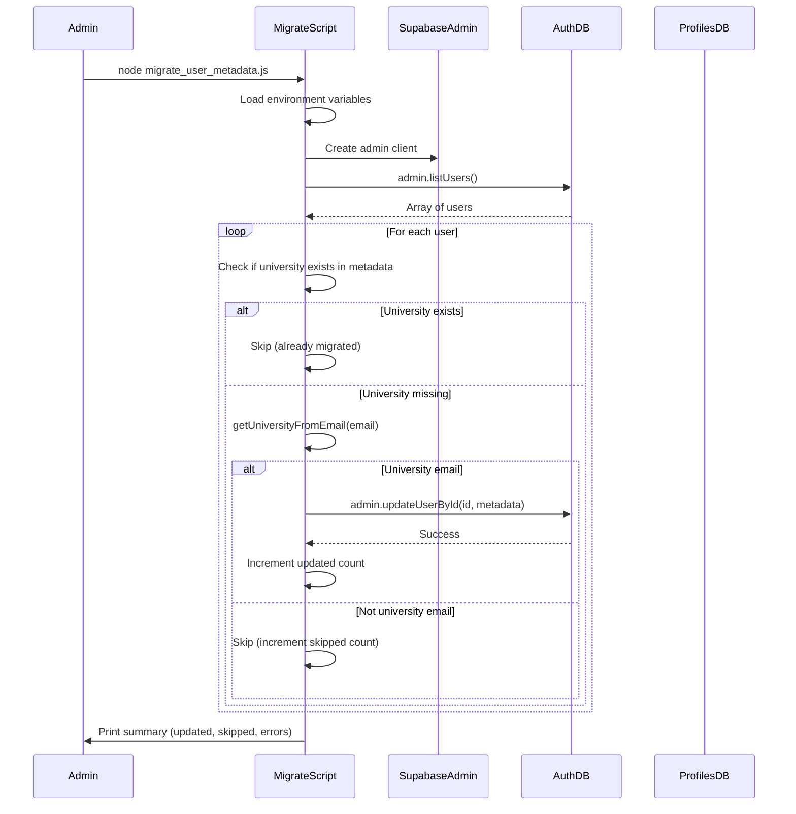

---

## Complete User Journey

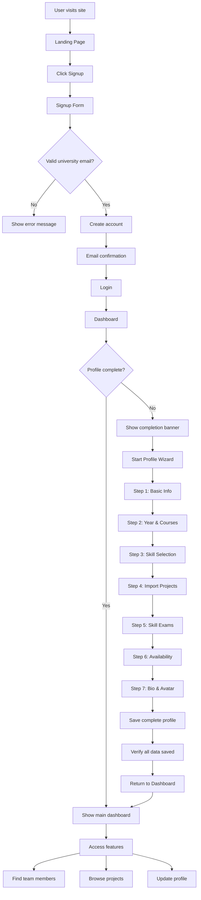

---

## Component Communication Map

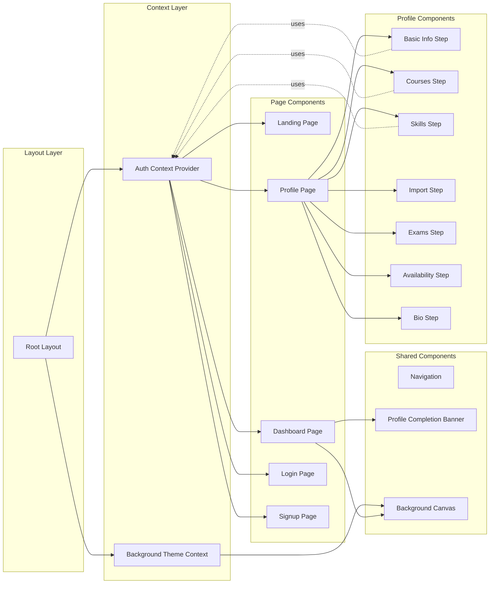

---

## Security Flow

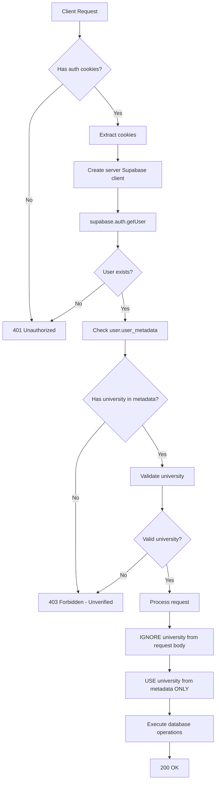

---

## Error Handling Flow

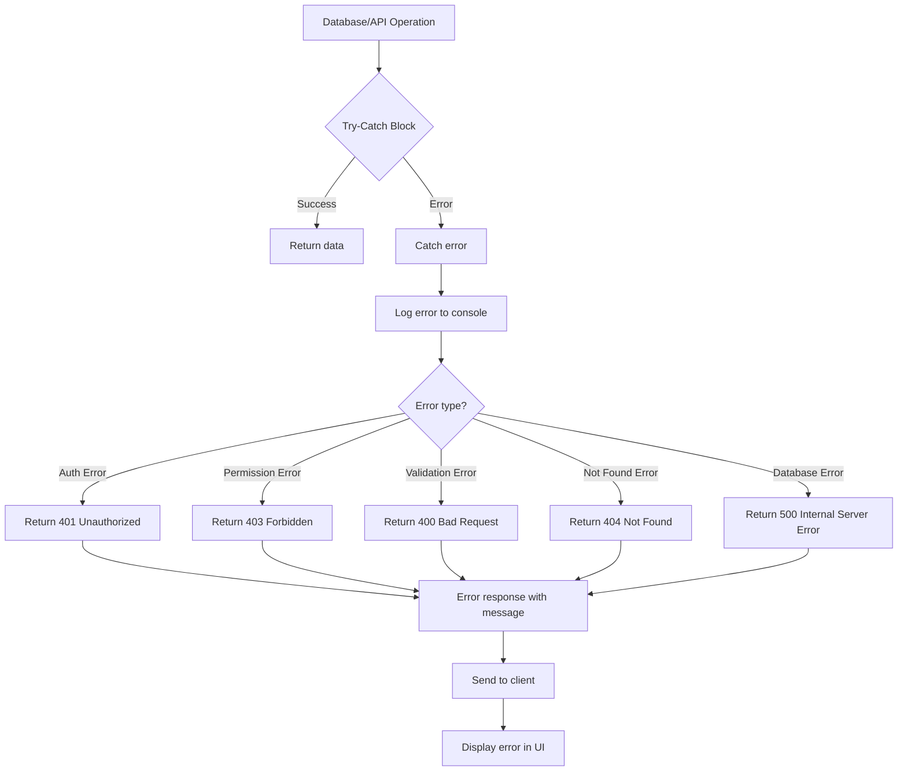

---

## Legend

### Node Types
- **Rectangle**: Process/Function
- **Diamond**: Decision point
- **Cylinder**: Database
- **Parallelogram**: Input/Output
- **Circle**: Start/End
- **Rounded Rectangle**: External system

### Arrow Types
- **Solid arrow**: Direct function call
- **Dotted arrow**: Uses/References
- **Dashed arrow**: Async operation

---

## Quick Reference: Function Call Graph

### Authentication Chain
```
useAuth() → AuthContext → supabase.auth → Supabase Auth Service → Database
```

### Profile Save Chain
```
saveProfile() → POST /api/profile → getUserFromRequest() → createClient() → supabase.from().upsert()
```

### Skill Matching Chain
```
Project Import → matchTagsToSkills() → matchTagToSkill() → SKILL_LOCKS lookup → Matched skills
```

### Data Generation Chain
```
CLI → main() → loadApiKeys() → APIManager → Multiple API clients → External APIs → Aggregated data
```

---

*This workflow diagram provides a visual representation of the complete system architecture. For detailed function documentation, see [FUNCTION_DOCUMENTATION.md](./FUNCTION_DOCUMENTATION.md)*
