# Team-Finder Workflow Diagram V2

> Canonical product workflow as one connected user journey graph.

This diagram presents Team-Finder as a connected product network. It emphasizes
the profile wizard as the required readiness gate before meaningful project
discovery and matching, and it places prefetching/resource enrichment inside the
Learning product area.

```mermaid
flowchart LR
    %% ------------------------------------------------------------
    %% User entry and authentication
    %% ------------------------------------------------------------
    U0([Student]) --> U1[Landing page\nUnderstand Team-Finder value]
    U1 --> A0{Has account?}
    A0 -->|No| A1[Signup\nUniversity email required]
    A0 -->|Yes| A2[Login\nSupabase session]
    A1 --> A3[Verify supported domain\nJU or HU]
    A3 --> A4[Create authenticated user\nUniversity metadata attached]
    A2 --> A5[Authenticated session]
    A4 --> A5
    A5 --> D0[Dashboard entry\nMain student hub]

    %% ------------------------------------------------------------
    %% Profile completion gate
    %% ------------------------------------------------------------
    D0 --> G0{Profile complete?}
    G0 -->|No| P0[Profile wizard required\nPrepare collaboration profile]
    G0 -->|Yes| H0[Ready dashboard\nProjects, learning, AI]

    P0 --> P1[Step 1\nBasic academic identity\nUniversity, major, specialization]
    P1 --> P2[Step 2\nYear, semester, completed courses]
    P2 --> P3[Step 3\nSkill selection\nCourse-informed skill readiness]
    P3 --> P4[Step 4\nRoadmap/import context\nProject and skill signals]
    P4 --> P5[Step 5\nSkill exams\nConfidence and verification]
    P5 --> P6[Step 6\nAvailability\nCollaboration schedule]
    P6 --> P7[Step 7\nBio and avatar\nPublic teammate profile]
    P7 --> P8[Save completed profile\nProfile, courses, skills, ratings]
    P8 --> H0

    %% ------------------------------------------------------------
    %% Project discovery after profile readiness
    %% ------------------------------------------------------------
    H0 --> PR0[Projects area unlocked\nDiscovery depends on profile readiness]
    PR0 --> PR1[Browse projects\nUniversity and external opportunities]
    PR0 --> PR2[Create project\nDefine title, description, skills, team size]
    PR1 --> PR3[Project detail\nSkills, status, members, remaining spots]
    PR2 --> PR3
    PR3 --> M0[Match reasoning\nCompare project needs to student profile]
    M0 --> M1[Skill vector similarity\nProject skills vs student skills]
    M0 --> M2[Availability fit\nCollaboration timing]
    M0 --> M3[Rating and penalty rules\nQuality and readiness signal]
    M1 --> M4[Ranked teammate/project fit]
    M2 --> M4
    M3 --> M4
    M4 --> PR4[Request to join or continue discovery]

    %% ------------------------------------------------------------
    %% Learning product area
    %% ------------------------------------------------------------
    H0 --> L0[Learning page\nGrowth and readiness center]
    L0 --> L1[Courses\nUniversity course catalog and resources]
    L0 --> L2[Dev tools\nGitHub, docs, and practical tooling]
    L0 --> L3[Personalized roadmaps\nCareer and skill paths]
    L0 --> L4[Learning progress\nCompleted nodes and courses]

    %% Prefetching is part of learning/resource enrichment
    L0 --> F0[Prefetching and resource enrichment\nProduct learning data pipeline]
    F0 --> F1[External sources\nGitHub, GitLab, Kaggle, HuggingFace, CTF, more]
    F1 --> F2[Normalize project/resource metadata\nTags, languages, descriptions]
    F2 --> F3[Infer skills and relevance\nMatch resources to majors and skills]
    F3 --> F4[Seed curated resources\nProjects, roadmaps, dev tools, learning data]
    F4 --> L1
    F4 --> L2
    F4 --> L3

    %% ------------------------------------------------------------
    %% AI assistant connections
    %% ------------------------------------------------------------
    H0 --> AI0[AI assistant\nConversational guidance]
    AI0 --> AI1[Understand student profile\nMajor, year, courses, skills]
    AI0 --> AI2[Update allowed student data\nCourses, skills, learning progress]
    AI0 --> AI3[Guide learning\nRoadmaps, courses, next steps]
    AI0 --> AI4[Support discovery\nProjects and potential teammates]
    AI1 --> P8
    AI2 --> L4
    AI3 --> L0
    AI4 --> PR0

    %% ------------------------------------------------------------
    %% Shared data backbone
    %% ------------------------------------------------------------
    P8 --> DB0[(Supabase data model\nProfiles, skills, courses, projects, progress)]
    PR0 --> DB0
    L0 --> DB0
    AI0 --> DB0
    DB0 --> ERD[Canonical ERD\nSee docs/assets/erd.png]

    %% ------------------------------------------------------------
    %% Styling
    %% ------------------------------------------------------------
    classDef person fill:#111827,stroke:#60a5fa,color:#f9fafb,stroke-width:2px;
    classDef page fill:#172554,stroke:#38bdf8,color:#f8fafc;
    classDef gate fill:#3b0764,stroke:#c084fc,color:#faf5ff,stroke-width:2px;
    classDef profile fill:#312e81,stroke:#818cf8,color:#eef2ff;
    classDef project fill:#064e3b,stroke:#34d399,color:#ecfdf5;
    classDef learning fill:#713f12,stroke:#fbbf24,color:#fffbeb;
    classDef ai fill:#7f1d1d,stroke:#f87171,color:#fff1f2;
    classDef data fill:#1f2937,stroke:#d1d5db,color:#f9fafb;

    class U0 person;
    class U1,A1,A2,A3,A4,A5,D0,H0 page;
    class A0,G0 gate;
    class P0,P1,P2,P3,P4,P5,P6,P7,P8 profile;
    class PR0,PR1,PR2,PR3,PR4,M0,M1,M2,M3,M4 project;
    class L0,L1,L2,L3,L4,F0,F1,F2,F3,F4 learning;
    class AI0,AI1,AI2,AI3,AI4 ai;
    class DB0,ERD data;
```

## Reading The Graph

- The student can reach the dashboard after authentication.
- If the profile is incomplete, the wizard becomes the required next step.
- Project discovery and matching are shown after the completed-profile gate.
- Learning is a product area that includes the external prefetching/resource
  enrichment pipeline.
- The AI assistant is connected to profile understanding, limited data updates,
  learning guidance, project discovery, and teammate discovery.
